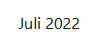
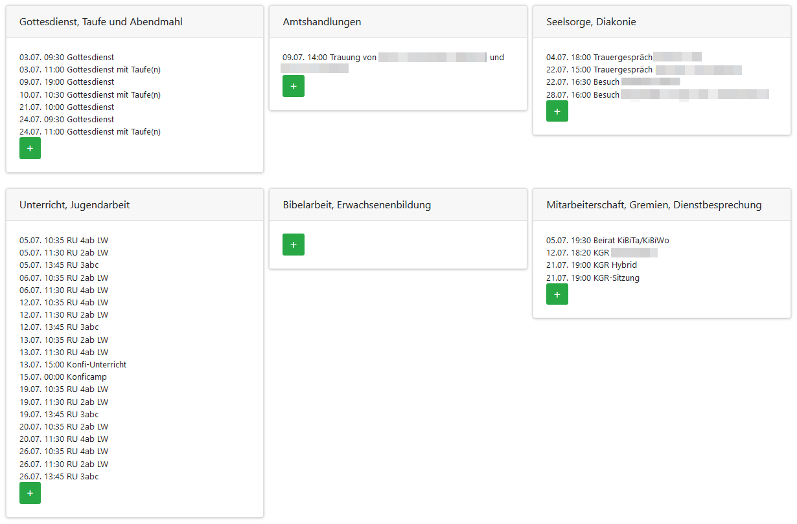
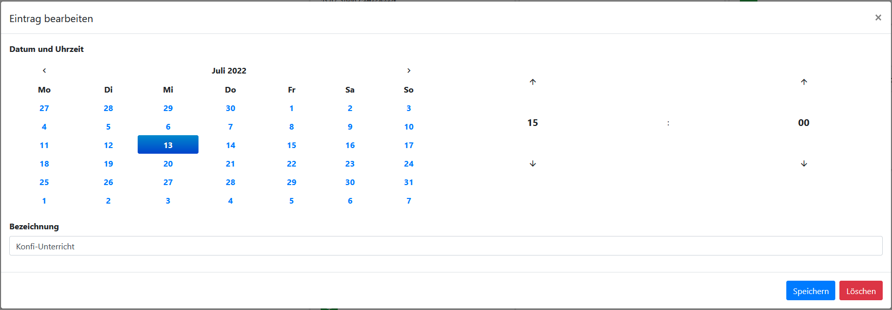
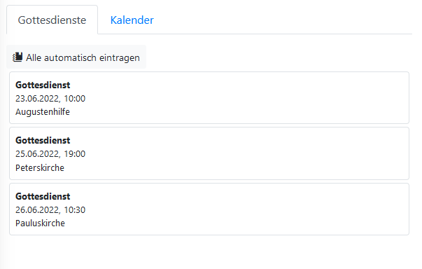
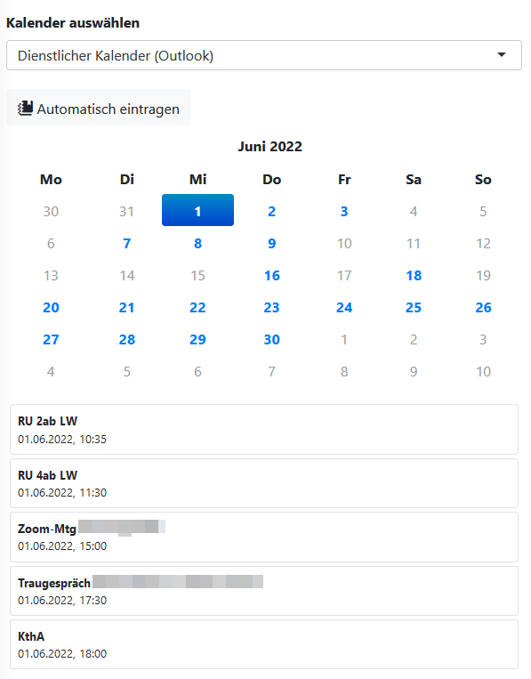
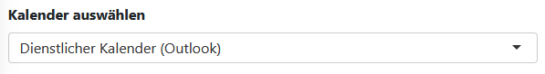
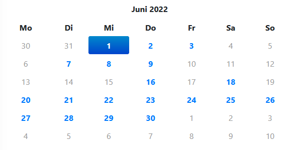

Amtskalender
============

Unter der Rubrik "Amtskalender" stehen für Pfarrer:innen Lösungen bereit, die beim Führen des offiziellen Amtskalenders helfen sollen. Gottesdienste und Kalendereinträge können in die Kategorien des Amtskalenders übernommen werden. Alle Einträge können als Worddokument im korrekten Format für den offiziellen Kalender exportiert werden.

## Schaltflächen

In der Kopfzeile der **Amtskalender-Seite** finden sich eine Reihe von **Schaltflächen** zur Navigation im Kalender und für häufig benötigte Aktionen.

Folgende Schaltflächen sind verfügbar:

| Schaltfläche | Funktion |
| --- | --- |
|  | Zeigt den **vorhergehenden Monat** an. |
|  | Zeigt den **aktuellen Monat** an. |
|  | Durch Klick auf das angezeigte Datum öffnet sich ein **Auswahlfeld für Monat und Jahr**. Der anzuzeigende Monat kann dort als Datum im Format *JJJJ-MM* eingegeben werden. Alternativ dazu können Jahr und Monat per Klick ausgewählt werden.  |
|  | Zeigt den **nachfolgenden Monat** an. |
|  | Öffnet den **Amtskalender** für den angezeigten Monat als **Microsoft Word-Dokument**. |

## Arbeitsfläche

Die Arbeitsfläche im Fenster "Amtskalender" besteht aus einer Spalte, in Ereignisse aus verschiedenen Quellen ausgewählt werden können, sowie sechs Kategoriefeldern für den Amtskalender.

### Kategoriefelder

Wie im gedruckten Amtskalender finden sich in diesem Bereich folgende **Kategorien**:

- Gottesdienst, Taufe und Abendmahl
- Amtshandlungen
- Seelsorge, Diakonie
- Unterricht, Jugendarbeit
- Bibelarbeit, Erwachsenenbildung
- Mitarbeiterschaft, Gremien, Dienstbesprechung

Bereits im Amtskalender eingetragene Ereignisse werden hier angezeigt. Mit der Maus können Ereignisse zwischen verschiedenen Kategorien **verschoben werden**.

Ein **Klick** auf ein hier eingetragenes Ereignis öffnet ein Dialogfenster zum **Bearbeiten** oder **Löschen** des Eintrags.

Durch Klick auf die Schaltfläche "Eintrag hinzufügen"  öffnet sich ein leeres Eingabefenster, in dem sich ein Eintrag manuell eingeben lässt.

### Quellen

In der Regel werden Einträge für den Amtskalender aus bestehenden Quellen einfach importiert. Dazu dienen die beiden Reiter "Gottesdienste" und "Kalender" im linken Bereich der Arbeitsfläche.

#### Reiter "Gottesdienste"

Im **Reiter "Gottesdienste"** werden Gottesdienste aus dem **[Kalender](calendar)** des Pfarrplaners angezeigt. Die Liste enthält alle Gottesdienste des **aktuell angezeigten Monats** an denen der/die **angemeldete Benutzer:in** beteiligt ist. Gottesdiensteinträge können einfach in das entsprechende **Kategoriefeld** gezogen werden.

Ein Klick auf die Schaltfläche **"Alle automatisch eintragen"**  übernimmt alle angezeigten Gottesdienste in die passende Kategorie.

#### Reiter "Kalender"

Im **Reiter "Kalender"** werden Kalendereinträge aus den im **[Benutzerprofil](user.profile)** **verbundenen Outlook-Kalendern** angezeigt. Im oberen Bereich kann dazu die verwendete Kalenderverbindung ausgewählt werden:

Angezeigt werden im unteren Bereich jeweils die Termine eines einzelnen Tages, der in der **Kalenderanzeige** ausgewählt werden kann. **Tage mit verwendbaren Termineinträgen** sind dort blau hinterlegt und anklickbar

Aus der **Terminliste** lassen sich einzelne Termine dann in die **Kategoriefelder** ziehen.

Ein Klick auf die Schaltfläche **"Automatisch eintragen"**  übernimmt alle Termine des angezeigten Monats automatisch in die passende Kategorie, sofern sie sich automatisch zuordnen lassen.

#### Automatische Zuordnung von Terminen aus einem Outlookkalender

Termine aus Outlookkalendern werden anhand von verschiedenen Kriterien automatisch zugeordnet. Am einfachsten geschieht das, indem in Outlook eine der folgenden **Kategorien** für den Termin vergeben wird:

- Amtskalender: Gottesdienst/Taufe/Abendmahl
- Amtskalender: Amtshandlungen
- Amtskalender: Seelsorge/Diakonie
- Amtskalender: Unterricht/Jugendarbeit
- Amtskalender: Bibelarbeit/Erwachsenenbildung
- Amtskalender: Mitarbeiterschaft/Gremien/Dienstbesprechung

Sollte die gewünschte Kategorie in Outlook noch nicht existieren, kann diese dort einfach angelegt werden. Wichtig ist nur, dass der Titel der Kategorie einem Element der o.g. Liste entspricht.

Neben der Nutzung von Kategorien reagiert der Pfarrplaner beim automatischen Eintrag auf eine Reihe von Stichwörtern, um die passende Kategorie zu finden. Das jeweilige Stichwort muss sich dabei in der Regel ganz am Anfang des Titels des Termins befinden.

Folgende Stichwörter werden aktuell erkannt:

| Kategorie | Stichwörter |
| ---------- | ---------- |
| Seelsorge, Diakonie | Trauergespräch, Geburtstagsbesuch, Besuch, Traugespräch, Taufgespräch, Ehejubiläum |
| Unterricht, Jugendarbeit | RU, KU, Konfi, Konfi... |
| Mitarbeiterschaft, Gremien, Dienstbesprechung | KGR, Sitzung, Planung, Beirat, Ausschuss, DB, Dienstbesprechung |
