Konfigurierbare Startseite
==========================

[//]: # (TOC: 5 Konfigurierbare Startseite)

Die Konfigurierbare Startseite gibt eine Übersicht über die anstehenden Dienste und erlaubt das direkte Ausführen bestimmter Aufgaben im Pfarrplaner.

Die Konfigurierbare Startseite erscheint in der Regel direkt nach der Anmeldung und kann auch im Menü durch Klicken auf den Titel "Pfarrplaner" aufgerufen werden:

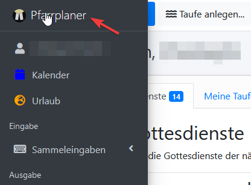

## Schaltflächen

Je nach Einstellung befinden sich in der Kopfzeile der **Konfigurierbaren Startseite** eine Reihe von **Schaltflächen** für häufig verwendete Aktionen:

Folgende Schaltflächen sind verfügbar:

| Schaltfläche | Funktion |
| --- | --- |
|  | Absprung auf den **[Kalender](calendar.md)**. |
| 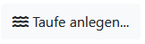 | [Anlegen einer **Taufe**](baptisms.create.md). **Hinweis**: Beim **Anlegen einer Taufe** über die **Konfigurierbare Startseite** ist es möglich, das **Datum** freizulassen. Auf diese Art kann eine **Taufanfrage** angelegt werden. Das **Datum** muss dann **später nachgepflegt** werden, womit aus der **Taufanfrage** eine **Taufe** wird. |
|  | [Anlegen einer **Beerdigung**](funerals.create.md). |
| 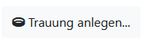 | [Anlegen einer **Trauung**](weddings.create.md) |

Die 3 **Schaltflächen** zum Anlegen von **Kasualien** (**Taufe**, **Beerdigung**, **Trauung**) werden nur angezeigt, wenn im [**Benutzerprofil**](user.profile.md) (1) im Bereich "**Startbildschirm**" (2) die Option "Schaltflächen für das schnelle Erstellen von Kasualien anzeigen" (3) aktiviert ist.

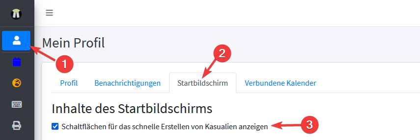

## Reiter

Benutzer:in kann durch Klicken auf die Schaltfläche "Anzeige" (1) oder über die Funktion [Eigenes Profil](user.profile.md) (2) einstellen, welche Reiter und welche Schaltflächen angezeigt werden.
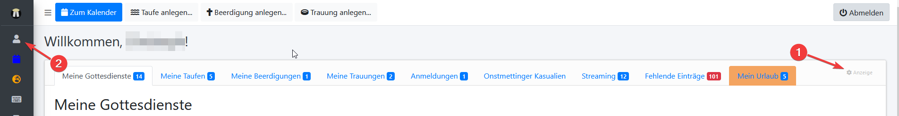

Folgende Reiter stehen zur Verfügung:

### Nächste Gottesdienste
**Nächste Gottesdienste** zeigt Übersichtsinformationen zu allen **Gottesdiensten** während der nächsten 2 Monate an **Gottesdienstorten**, die dem **Benutzerstamm** der/s angemeldeten Benutzer:in zugeordnet sind.
Im [**Benutzerprofil**](user.profile.md) kann festgelegt werden, ob hier **alle Gottesdienste** angezeigt werden, oder nur solche, in denen die/der angemeldete **Benutzer:in** einen Dienst versieht. Je nach Einstellung lautet der Titel des Reiters "Nächste Gottesdienste" oder "Meine Gottesdienste".

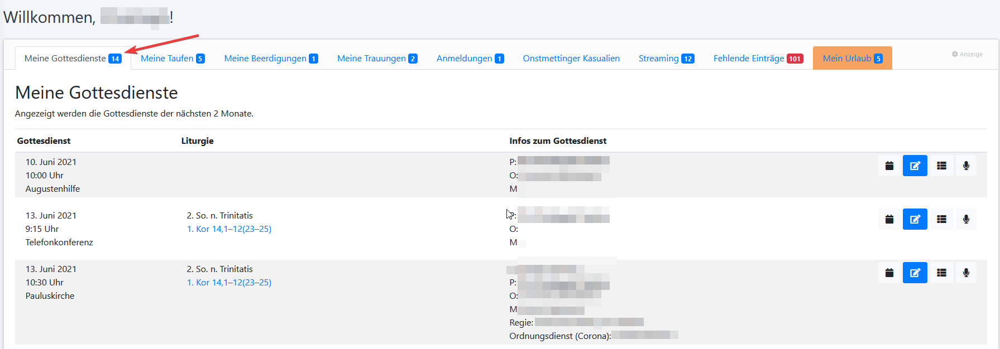

Im **[Benutzerprofil](user.profile.md)** kann ausgewählt werden, ob hier nur **Gottesdienste** erscheinen, bei denen der/die **Benutzer:in** als **Beteiligte:r** aufgeführt ist, oder ob alle **Gottesdienste** der zugeordneten **Gottesdienstorte** angezeigt werden sollen.

### Nächste Gottesdienste (mit Opferzweck)
**Nächste Gottesdienste mit Opferzweck** zeigt Übersichtsinformationen incl. des **Opferzwecks** zu allen **Gottesdiensten** während der nächsten 2 Monate in Gottesdienstorten, die dem **Benutzerstamm** der/s angemeldeten **Benutzer:in** zugeordnet sind.

### Taufen
Der Reiter **Taufen** zeigt Übersichtsinformationen zu allen zukünftigen **Taufen**, sowie zu offenen **Taufanfragen** an. **Taufanfragen** sind **Taufen**, die noch keinem Gottesdienst zugeordnet wurden. Im [**Benutzerprofil**](user.profile.md) kann festgelegt werden, ob hier **alle Taufen** angezeigt werden, oder nur solche, in denen die/der angemeldete **Benutzer:in** einen Dienst versieht. Je nach Einstellung lautet der Titel des Reiters "Taufen" oder "Meine Taufen".

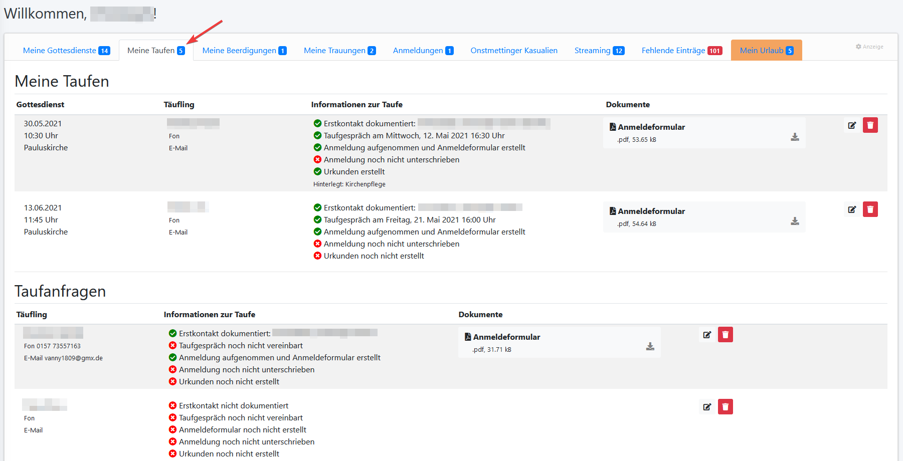

Im **[Benutzerprofil](user.profile.md)** kann ausgewählt werden, ob hier nur **Taufen** erscheinen, bei denen der/die **Benutzer:in** als **Beteiligte:r** aufgeführt ist, oder ob alle **Gottesdienste** der zugeordneten **Gottesdienstorte** angezeigt werden sollen.

#### Aktionen auf dem Reiter "Taufen"

| Schaltfläche | Funktion |
| --- | --- |
|  | Öffnet die Maske zum [**Bearbeiten**  der angezeigten **Taufe** oder **Taufanfrage**](baptisms.edit.md). |
|  | **Löscht** die angezeigte **Taufe** oder **Taufanfrage**.
| | Lädt das angegebene **Dokument** herunter. |

### Beerdigungen
Der Reiter "Beerdigungen" zeigt Übersichtsinformationen zu allen offenen **Beerdigungen** sowie zu **Beerdigungen** der letzten 2 Wochen. Im [**Benutzerprofil**](user.profile.md) kann festgelegt werden, ob hier **alle Beerdigungen** angezeigt werden, oder nur solche, in denen die/der angemeldete **Benutzer:in** einen Dienst versieht. Je nach Einstellung lautet der Titel des Reiters "Beerdigungen" oder "Meine Beerdigungen". 

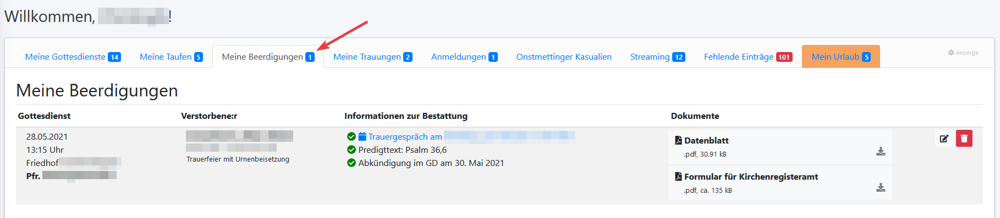

#### Aktionen auf dem Reiter "Beerdigungen"

| Schaltfläche | Funktion |
| --- | --- |
|  | Öffnet die Maske zum [**Bearbeiten** der angezeigten **Beerdigung**](funerals.edit.md). |
|  | **Löscht** die angezeigte **Beerdigung** oder **Taufanfrage**.
| | Lädt das angegebene **Dokument** herunter. |

### Trauungen

Der Reiter "Trauungen" zeigt Übersichtsinformationen zu allen offenen **Trauungen** sowie zu **Trauungen** der letzten 2 Wochen. Im [**Benutzerprofil**](user.profile.md) kann festgelegt werden, ob hier **alle Trauungen** angezeigt werden, oder nur solche, in denen die/der angemeldete **Benutzer:in** einen Dienst versieht. Je nach Einstellung lautet der Titel des Reiters "Trauungen" oder "Meine Trauungen".

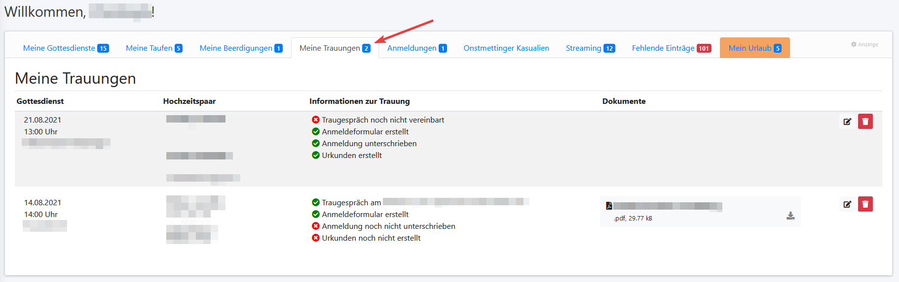

#### Aktionen auf dem Reiter "Trauungen"

| Schaltfläche | Funktion |
| --- | --- |
|  | Öffnet die Maske zum [**Bearbeiten** der angezeigten **Trauung**](weddings.edit.md). |
|  | **Löscht** die angezeigte **Trauung** oder **Taufanfrage**.
| | Lädt das angegebene **Dokument** herunter. |

### Anmeldungen

Der Reiter "Anmeldungen" zeigt Übersichtsinformationen zu allen offenen **Gottesdiensten**, bei denen die Markierung "Für diesen Gottesdienst ist eine Anmeldung notwendig" gesetzt ist.

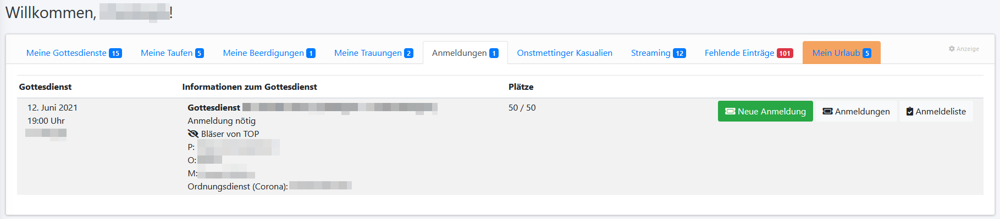

#### Aktionen auf dem Reiter "Anmeldungen"

| Schaltfläche | Funktion |
| --- | --- |
|  | Öffnet die Maske zum [**Anlegen einer Anmeldung** für den angezeigten **Gottesdienst**](seatfinder.md). |
| 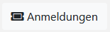 | Absprung zur [Anzeige der **Anmeldungen** für den angezeigten **Gottesdienst**](service.bookings.md). |
| | Lädt ein **druckbares PDF-Dokument** mit einer [Liste aller **Anmeldungen** für den angezeigten **Gottesdienst**](booking.finalize.md) herunter.. |

### Kasualien

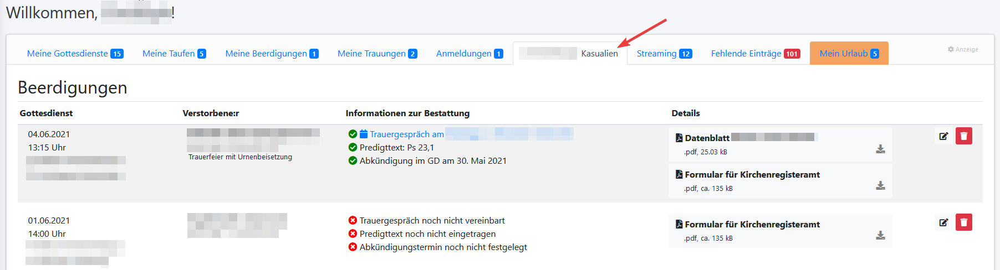

Ein Reiter des Typs "Kasualien" zeigt Übersichtsinformationen zu allen **Kasualien** (**Taufen**, **Trauungen** und **Taufen**) in ausgewählten Kirchengemeinden. Im [**Benutzerprofil**](user.profile.md) kann festgelegt werden, **welche Kirchengemeinden** angezeigt werden und welchen **Titel** der Reiter tragen soll.

Die Anzeige erfolgt in der **Reihenfolge** **Beerdigungen**, **Trauungen** und **Taufen**. Die jeweils **angezeigten Informationen**,  sowie die verfügbaren **Aktionen** entsprechen der Anzeige in den Reitern "**Beerdigungen**", "**Trauungen**" und "**Taufen**".

### Streaming

Der Reiter "Streaming" zeigt Übersichtsinformationen zu allen **Gottesdiensten** der nächsten 2 Monate an ausgewählten **Gottesdienstorten**. 
Die dargestellten Informationen beziehen sich auf die **Übertragung von Gottesdiensten per Livestream**.
Im [**Benutzerprofil**](user.profile.md) kann festgelegt werden, welche **Gottesdienstorte** berücksichtigt werden.

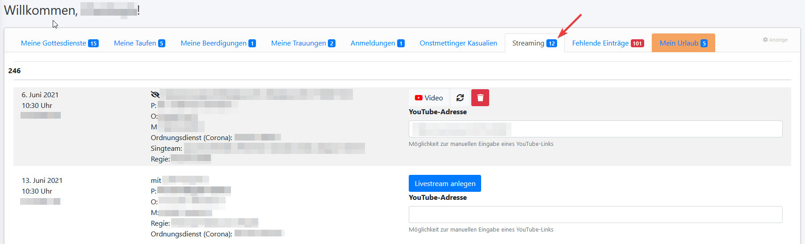

#### Aktionen auf dem Reiter "Streaming"

| Schaltfläche | Funktion |
| --- | --- |
|  | Öffnet das **YouTube-Video** zum angezeigten **Gottesdienst** in einem neuen Fenster.
|  | Öffnet das **Livestreaming Dashboard** zum **YouTube-Video**  des angezeigten **Gottesdiensts** in einem neuen Fenster.
| 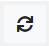 | Aktualisiert die Beschreibung des **Videos** zum **Gottesdienst** auf **YouTube**. |
| | Löscht den **Livestream auf YouTube**, der dem angezeigten **Gottesdienst** zugeordnet ist. |

### Fehlende Einträge

Der Reiter "Fehlende Einträge" zeigt Übersichtsinformationen zu allen offenen **Gottesdiensten** an **Gottesdienstorten**, die dem Benutzerstamm der/s angemeldeten Benutzer:in zugeordnet sind, bei denen die **Einteilung bestimmter Dienste** noch fehlt. 
Im [**Benutzerprofil**](user.profile.md) kann festgelegt werden, welche **Dienste** dabei berücksichtigt werden.

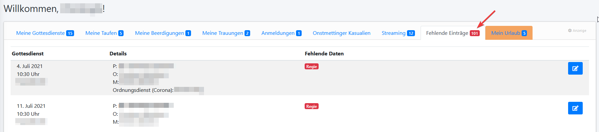

#### Aktionen auf dem Reiter "Fehlende Einträge"

| Schaltfläche | Funktion |
| --- | --- |
|  | Öffnet die Maske zum [**Bearbeiten** des angezeigten **Gottesdiensts**](services.edit.md).

### Mein Urlaub

Der Reiter "Mein Urlaub" zeigt Abwesenheitszeiten und Vertreter:innen des/der angemeldeten Benutzer:in. Zudem werden die Zeiten angezeigt, zu denen die/der angemeldete Benutzer:in als Vertreter:in für andere Personen eingetragen ist.

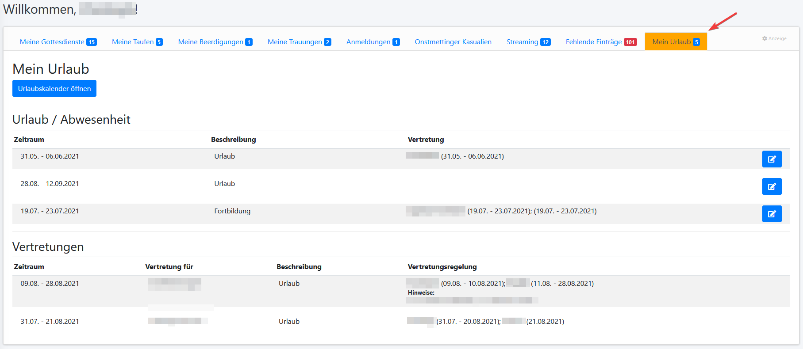

#### Aktionen auf dem Reiter "Fehlende Einträge"

| Schaltfläche | Funktion |
| --- | --- |
|  | Absprung zum [**Urlaubskalender**](absences.index.md).
|  | Öffnet die Maske zum [**Bearbeiten** der angezeigten **Abwesenheit**](absences.edit.md).

