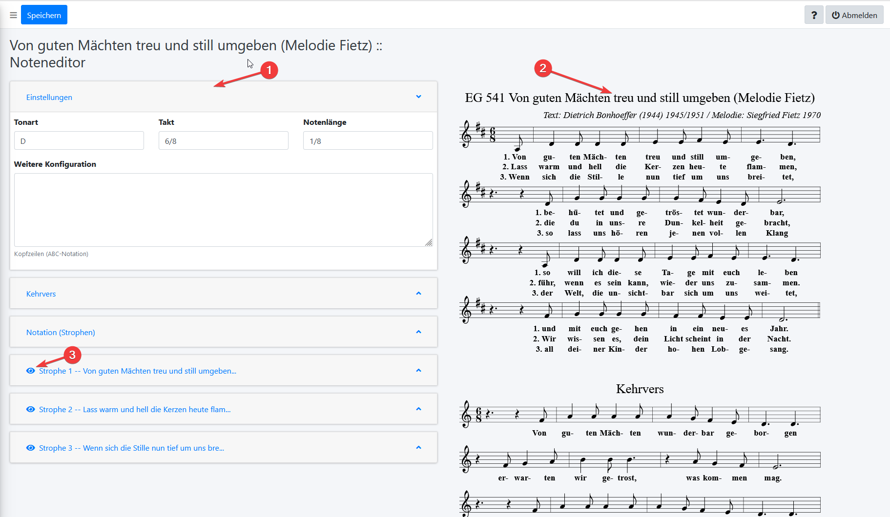
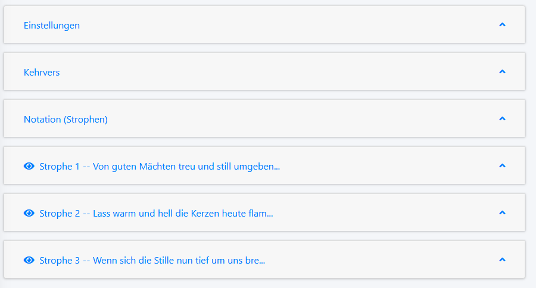
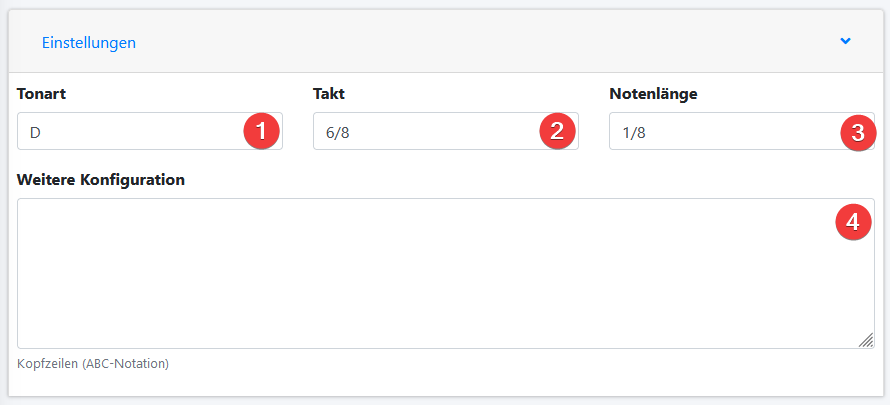
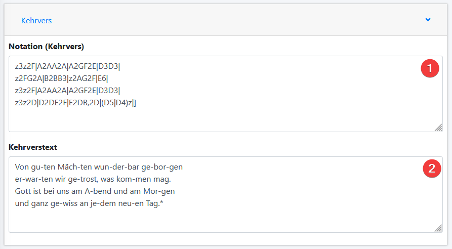
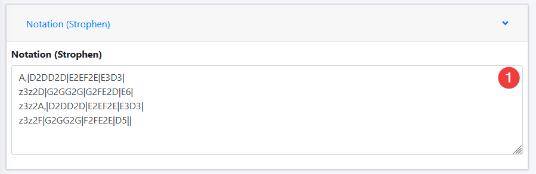
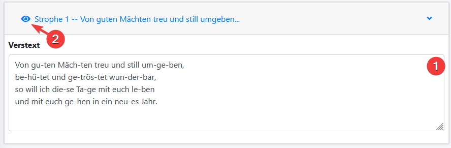

Noteneditor
===========

Mit dem Noteneditor können zu einem bestehenden Lied Noten hinterlegt werden. Diese stehen dann in verschiedenen Ausgabeformaten der Liturgie zur Verfügung.

Zur Eingabe von Noten wird der "*ABC-Standard*" verwendet. Eine ausführliche Einführung in diese Notation würde die Grenzen dieses Handbuchs überschreiten. Ausführliche Einführungen finden sich [hier](https://penzeng.de/Geige/Abc.htm) und in [diesem Dokument](http://abcplus.sourceforge.net/ABCPlus.pdf). Diese können bei der Eingabe als Referenz dienen.

Bei der Eingabe ist zu beachten, dass die vorhandenen Ausgabeformate die Noten als Einzelzeilen ausgeben, um Folienwechsel, Seitenumbrüche usw. zu gewährleisten. Dabei findet keine Interpretation von Wiederholungszeichen usw. statt. Es empfiehlt sich daher, diese komplett zu vermeiden und wiederholte Teile explizit mehrfach zu notieren.

Aus demselben Grund trennt der Noteneditor zwischen Kehrvers und Strophen.

## Schaltflächen

Folgende Schaltflächen stehen am oberen Bildschirmrand zur Verfügung.

| Schaltfläche | Funktion |
| --- | --- |
|  | Die Noten zum Lied werden gespeichert. Das Fenster bleibt zur weiteren Bearbeitung geöffnet. Das Schließen kann über das Schließfeld des Browsertabs geschehen. |


## Übersicht



Der Noteneditor ist in zwei Bereiche unterteilt: Im Eingabebereich (1) finden sich verschiedene Reiter, in denen sich Einstellungen, Notation und Textteile bearbeiten lassen.  In der Vorschau (2) findet sich eine Vorschau der bereits eingegebenen Notation. Mit den Augensymbolen (3) im Eingabebereich lässt sich der Übersicht halber die Anzeige von Strophen einzeln an- bzw. abschalten.

## Eingabebereiche

Der Eingabebereich ist in eine Reihe von Reitern unterteilt, von denen jeweils nur einer geöffnet sein kann. Durch Klicken auf die Titelzeile eines Reiters öffnet dieser sich.



### Reiter "Einstellungen"



Hier lassen sich die grundlegenden Einstellungen für ein Lied anlegen.

* **Tonart** (1): Die Tonart des Liedes. Von der Tonart hängen die Vorzeichen ab. Beispiele: ````C```` oder ````Cmaj```` für C-Dur, ````Am```` oder ````Amin```` für A-Moll, ````F#m```` für Fis-Moll, ````Eb```` für Es-Dur, ````Bm```` für H-Moll (In der *ABC-Notation* gilt die englische Schreibweise, bei der das deutsche "H" als ````B````, das deutsche B als ````Bb```` geschrieben wird). Auch Kirchentonarten sind möglich; man schreibt z. B. ````C dor```` oder ````Cdor```` oder ````C dorian```` für C dorisch. Dieses Eingabefeld entspricht der Kopfzeile ````K:```` im *ABC-Standard*.
* **Takt** (2): Hier steht die Taktart des Liedes, z.B. ````3/4````. Die Eingabe ````C```` entspricht ````4/4````, ````C|```` entspricht ````2/2````. Das Feld kann auch leer bleiben, wenn kein Metrum notiert werden soll. Dieses Eingabefeld entspricht der Kopfzeile ````M:```` im *ABC-Standard*.
* **Notenlänge** (3): Hier steht der Standard-Notenwert. Z.B. heißt 1/8, dass alle Noten ohne Längenangabe als Achtelnoten interpretiert werden. Dieses Eingabefeld entspricht der Kopfzeile ````L:```` im *ABC-Standard*.
* **Weitere Konfiguration** (4): Hier können, wenn nötig, mit Ausnahme von ````X:````, ````K:````, ````L:````, ````M:```` alle weiteren möglichen Kopfzeilen des *ABC-Standards* notiert werden.

### Reiter "Kehrvers"



Im Reiter "Kehrvers" werden Notation und Text eines möglicherweise vorhandenen Kehrverses eingegeben. Hat das Lied keinen Kehrvers, dann bleibt dieser Bereich leer.

Im Bereich **Notation (Kehrvers)** (1) steht die *ABC-Notation* des Kehrverses. Dafür gelten die im Reiter "Einstellungen" getroffenen Grundeinstellungen.

Im Bereich **Kehrverstext** steht der Text des Kehrverses so, dass er sich passend auf die zugehörigen Noten verteilt. Die Schreibweise entspricht dem Feld ````w:```` im *ABC-Standard* (siehe [hier](https://penzeng.de/Geige/Abc2.htm#ww)).

Die wichtigsten **Steuerzeichen** dabei sind:

| Steuerzeichen | Funktion |
| --- | --- |
| ````-```` (Bindestrich) | Silbentrennung (eine Silbe pro Note) |
| ````*```` (Stern) | Hier wird eine Note bei der Textnotation ausgelassen. |
| ````_```` (Unterstrich) | Folgt ein Unterstrich auf eine Silbe, so wird diese auch im Notenbild mittels eines Unterstrichs auf eine weitere Note verlängert. |


### Reiter "Notation (Strophen)"



Im Reiter "Notation (Strophen)" steht im gleichnamigen Feld (1) die *ABC-Notation* der Strophen. Der Pfarrplaner geht davon aus, dass alle Strophen eines Lieds dieselbe Melodie haben.

Für die hier eingegebene Notation gelten die im Reiter "Einstellungen" getroffenen Grundeinstellungen.

### Reiter "Strophe ..."



Der Reiter "Strophe ..." ist pro Strophe einmal vorhanden. 

Im Bereich **Verstext** (1) steht der Text der Strophe so, dass er sich passend auf die im Reiter "Notation (Strophen)" eingegebenen Noten verteilt. Die Schreibweise entspricht dem Feld ````w:```` im *ABC-Standard* (siehe [hier](https://penzeng.de/Geige/Abc2.htm#ww)).

Die wichtigsten **Steuerzeichen** dabei sind:

| Steuerzeichen | Funktion |
| --- | --- |
| ````-```` (Bindestrich) | Silbentrennung (eine Silbe pro Note) |
| ````*```` (Stern) | Hier wird eine Note bei der Textnotation ausgelassen. |
| ````_```` (Unterstrich) | Folgt ein Unterstrich auf eine Silbe, so wird diese auch im Notenbild mittels eines Unterstrichs auf eine weitere Note verlängert. |

Durch einen Klick auf das **Augensymbol** (2) in der Titelzeile des Reiters kann die Anzeige der Strophe im **Vorschaubereich** ein- oder ausgeschaltet werden.


